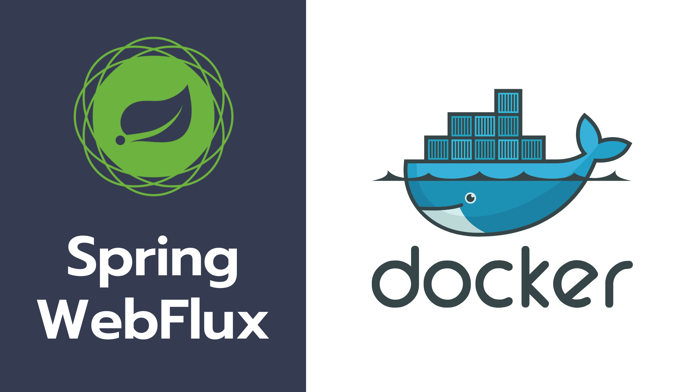

# Docker With Spring Webflux

This repo contains the source code for the application developed in this course.

Along with learning Docker, We will also see how docker can be helpful in a Java developer day-to-day life. Increasing Productivity and Quality of our deliverables with the help of Docker. That is the ultimate goal of the course.

By the end of this course you would be comfortable with:

## Docker From Scratch

- We will start from the story behind docker creation, why developer needs to learn Docker, How docker is different from Virtual Machines.

- Mastering Docker commands and debugging

- Creating Docker Containers and Various run options

- Port Mapping / Volume Mapping

- Creating our own Docker Images

- Docker Networks / Creating custom bridge network

## Docker Compose

- Declarative way of creating docker containers

- Port & Volume mappings with Docker Compose

- MongoDB and Mongo Express

- Postgres and Adminer

## Dockerizing Spring Application

- Microservice Development with Spring WebFlux

- Reactive Mongo

- Packaging our Spring application as Docker Image

- Multi Stage Dockerfile

## Integration Testing With Test Container

- Improving the quality of our application by writing integration tests using Docker

## Mockserver

- How Mockserver works

- Starting early development process when the dependent service is not ready in Microservices architecture

- Writing Integration tests along with Mockserver

## API Gateway with Nginx

- Using Nginx for Path based routing and Load balancing

- Nginx + Microservices + Docker Compose to simulate mini cloud in our local for testing
